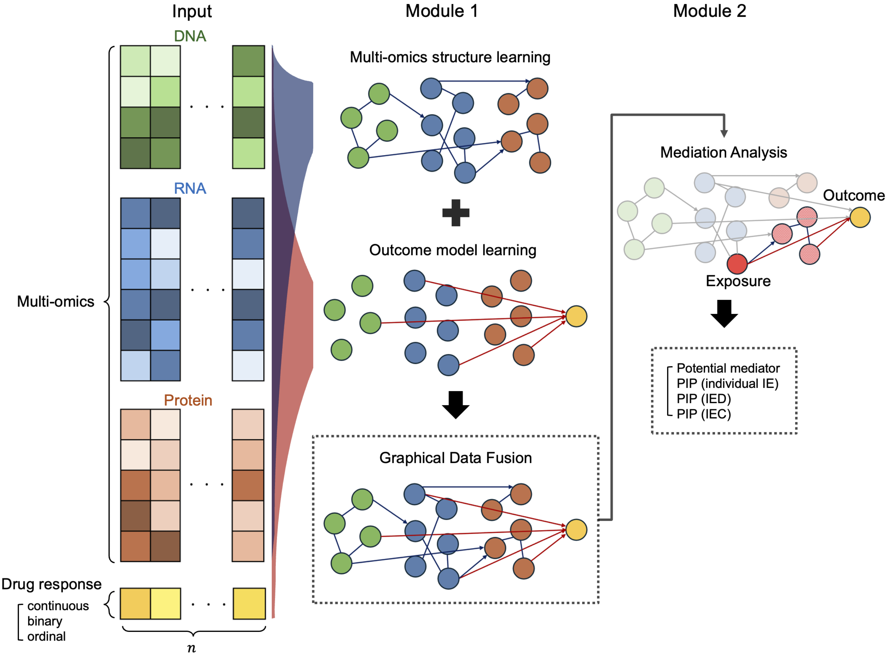
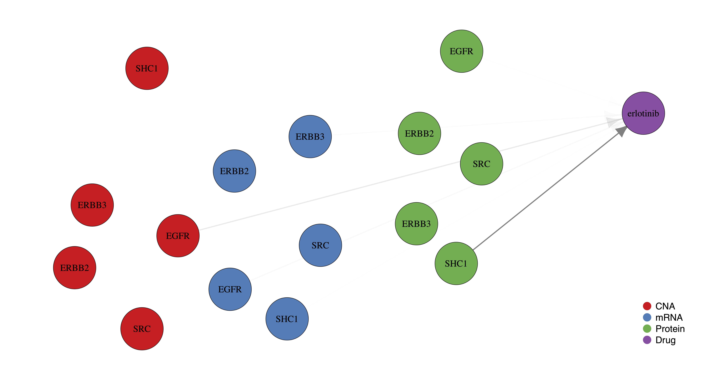
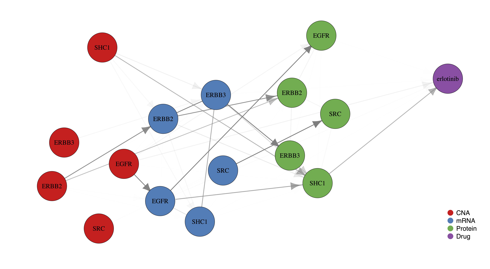
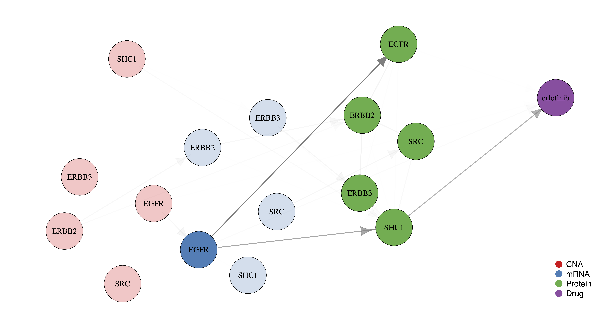

# GFusionMed: Graphical Fusion and Mediation in Pharmaco-omics

## Overview

**`GFusionMed`** is an R package designed for Bayesian graphical data fusion
and mediation analysis, tailored specifically for pharmaco-omics
research. It incorporates multi-layered graphical models and advanced
mediation analysis methods, providing an efficient and user-friendly
pipeline for exploring complex biological relationships.

**`GFusionMed`** consists of two main modules: Module 1 focuses on Graphical Data Fusion, and Module 2 handles Mediation Analysis.
This framework facilitates the analysis of multi-omics data, including genetic,
transcriptomic, and proteomic information, to investigate how
these layers mediate pharmacological responses. By simplifying the implementation of these
sophisticated techniques, **`GFusionMed`** aims to accelerate discoveries in
the field of pharmaco-omics.



**Module 1: Graphical Data Fusion**

-   **`fit_structure_model`**: Constructs a multi-layered graphical model to
    capture both undirected (within-layer) and directed (between-layer)
    relationships in multi-omics data.
-   **`fit_outcome_model`**: Fits an outcome model to study the
    relationships between omics data and a specific outcome (e.g., drug
    response), compatible with various types of outcomes (continuous,
    binary, ordinal).
-   **`plot_network`**: Visualizes the fused multi-omics network, where edge
    transparency reflects the strength of inferred relationships. The
    function incorporates **`edge_summary`** function to highlight and
    summarize key edges, showcasing significant relationships between
    omics layers. Results from **`fit_structure_model`** and
    **`fit_outcome_model`** are used to generate a network plot in **`.pdf`**
    format, providing a clear visual representation of the most
    important interactions.

**Module 2: Mediation Analysis**

-   **`perform_mediation_analysis`**: Conducts mediation analysis to
    identify indirect effects of omics variables on outcomes, revealing
    potential causal pathways between multi-omics data and the observed
    pharmacological response.
-   **`plot_network`**: This function is also used in mediation analysis to
    visualize networks, with options to fix an exposure variable for
    specific mediation insights.

## Installation

```{r, eval = FALSE}
devtools::install_github("downey21/GFusionMed", build_vignettes = TRUE)
```

## Usage

```{r, eval = FALSE}
# load package
library(GFusionMed)

# Example datasets
data(example_data_for_structure, package = "GFusionMed")
data(example_data_for_outcome, package = "GFusionMed")

# Multi-omics structure learning
# example_result_structure <- GFusionMed::fit_structure_model(example_data_for_structure,
#     cores = 3)
# just load for example of fitted result
data(example_result_structure, package = "GFusionMed")

# Outcome model learning
# example_result_outcome <- GFusionMed::fit_outcome_model(example_data_for_outcome)
# just load for example of fitted result
data(example_result_outcome, package = "GFusionMed")

# structure network visualilzation
GFusionMed::plot_network(result_structure = example_result_structure,
    path = "Set your path", file_name = "plot_network_structure")

# outcome network visualilzation
GFusionMed::plot_network(result_outcome = example_result_outcome,
    path = "Set your path", file_name = "plot_network_outcome")

# structure-outcome network visualilzation
GFusionMed::plot_network(result_structure = example_result_structure,
    result_outcome = example_result_outcome, path = "Set your path",
    file_name = "plot_network_structure_outcome")

# Mediation analysis
GFusionMed::perform_mediation_analysis(example_result_structure,
    example_result_outcome)

# Mediation analysis for specific exposure
# variable
example_exposure <- "mRNA_EGFR"
GFusionMed::perform_mediation_analysis(example_result_structure,
    example_result_outcome, example_exposure)

# Network visualization for specific exposure
# variable
GFusionMed::plot_network(result_structure = example_result_structure,
    result_outcome = example_result_outcome, exposure = example_exposure,
    path = "Set your path", file_name = "plot_network_structure_outcome_exposure")
```

# Application to DepMap Data

## Preprocessing of pharmaco-omics data

We applied our **`GFusionMed`** method to lung cancer cell line data from
the DepMap project. The analysis integrated multiple omics layers,
including copy number alterations (CNA), mRNA expression (mRNA),
RPPA-based proteomics (Protein), and drug response data (Drug). Our goal
was to uncover omics-level mediators influencing drug response, focusing
on 10 key signaling pathways related to lung cancer.

For this study, we used the following datasets from the DepMap project:

-   CNA (depmap 22Q2)
-   mRNA (depmap 22Q2)
-   protein (depmap 19Q3)
-   Meta (depmap 22Q2)
-   Drug (depmap 21Q2)

The drugs selected for the analysis were six lung cancer-associated
treatments:

-   erlotinib
-   gefitinib
-   afatinib
-   dacomitinib
-   osimertinib
-   cisplatin

By applying our graphical data fusion and mediation analysis, we
identified key molecular mediators that play a role in influencing the
response to these drugs. We expect our findings to provide new insights
into the biological processes underlying drug response in lung cancer,
paving the way for personalized therapeutic strategies. To understand
the usage of `GFusionMed`, let’s explore a specific example by examining
how multiple omics layers influence Erlotinib drug response within the
RTK pathway.

We used the **`depmap`** R package to download multi-omics data (CNA, mRNA,
and protein) for cancer cell lines. Using the metadata, we specifically
filtered the data to focus on lung cancer cell lines. Since RPPA data is
based on antibody-based protein measurements, it requires mapping
between antibodies and target genes. DepMap provides this mapping
information in a file named **`CCLE_RPPA_Ab_info_20181226.csv`**.
Additionally, we filtered the drug response data to include responses
for six specific drugs. The complete analysis process, including the
code, is provided below.

```{r, eval = FALSE}
# install.packages('BiocManager')
# BiocManager::install('depmap')

suppressPackageStartupMessages({
    library(depmap)

    library(dplyr)
    library(stringr)
    library(tidyr)
    library(tibble)
})

path_data <- "./application/data"

cna <- depmap::depmap_copyNumber()  # CNA (depmap 22Q2)
mrna <- depmap::depmap_TPM()  # mRNA (depmap 22Q2)
protein <- depmap::depmap_RPPA()  # protein (depmap 19Q3)
meta <- depmap::depmap_metadata()  # Meta (depmap 22Q2)
drug <- depmap::depmap_drug_sensitivity()  # Drug (depmap 21Q2)

env_save <- new.env(parent = emptyenv())
env_save$cna <- cna
env_save$mrna <- mrna
env_save$protein <- protein
env_save$meta <- meta
env_save$drug <- drug

do.call("save", c(ls(envir = env_save), list(envir = env_save,
    file = paste0(path_data, "/data_cna_mrna_protein_meta_drug.RData"))))

loaded_data <- load(paste0(path_data, "/data_cna_mrna_protein_meta_drug.RData"))
ab_map <- tibble::as_tibble(read.csv(paste0(path_data,
    "/CCLE_RPPA_Ab_info_20181226.csv")))

drug_lung_cancer <- c("erlotinib", "gefitinib", "afatinib",
    "dacomitinib", "osimertinib", "cisplatin")

# common depmap_id
lung_cancer_depmap_id <- meta %>%
    dplyr::filter(primary_disease == "Lung Cancer") %>%
    dplyr::pull(depmap_id)

lung_cancer_depmap_id_cna <- cna %>%
    dplyr::filter(depmap_id %in% lung_cancer_depmap_id) %>%
    dplyr::pull(depmap_id)

lung_cancer_depmap_id_mrna <- mrna %>%
    dplyr::filter(depmap_id %in% lung_cancer_depmap_id) %>%
    dplyr::pull(depmap_id)

lung_cancer_depmap_id_protein <- protein %>%
    dplyr::filter(depmap_id %in% lung_cancer_depmap_id) %>%
    dplyr::pull(depmap_id)

lung_cancer_depmap_id_drug <- drug %>%
    dplyr::filter(depmap_id %in% lung_cancer_depmap_id) %>%
    dplyr::pull(depmap_id)

lung_cancer_depmap_id_intersect <- base::intersect(base::intersect(base::intersect(lung_cancer_depmap_id_cna,
    lung_cancer_depmap_id_mrna), lung_cancer_depmap_id_protein),
    lung_cancer_depmap_id_drug)

# make dataset for lung cancer data
cna_lung_cancer <- cna %>%
    dplyr::filter(depmap_id %in% lung_cancer_depmap_id_intersect) %>%
    dplyr::select(c("depmap_id", "gene_name", "log_copy_number")) %>%
    tidyr::pivot_wider(names_from = gene_name, values_from = log_copy_number) %>%
    dplyr::arrange(depmap_id)

mrna_lung_cancer <- mrna %>%
    dplyr::filter(depmap_id %in% lung_cancer_depmap_id_intersect) %>%
    dplyr::select(c("depmap_id", "gene_name", "rna_expression")) %>%
    tidyr::pivot_wider(names_from = gene_name, values_from = rna_expression) %>%
    dplyr::arrange(depmap_id)

protein_lung_cancer <- protein %>%
    dplyr::filter(depmap_id %in% lung_cancer_depmap_id_intersect) %>%
    dplyr::select(c("depmap_id", "antibody", "expression")) %>%
    tidyr::pivot_wider(names_from = antibody, values_from = expression) %>%
    dplyr::arrange(depmap_id)

colnames(protein_lung_cancer) <- c("depmap_id", unname(sapply(ab_map$Target_Genes,
    function(x) stringr::str_split(x, " ")[[1]][1])))
protein_lung_cancer <- protein_lung_cancer[, !duplicated(names(protein_lung_cancer))]

drug_lung_cancer <- drug %>%
    dplyr::filter(depmap_id %in% lung_cancer_depmap_id_intersect) %>%
    dplyr::select(c("depmap_id", "name", "dependency")) %>%
    dplyr::filter(name %in% drug_lung_cancer) %>%
    tidyr::pivot_wider(names_from = name, values_from = dependency) %>%
    dplyr::arrange(depmap_id)

env_save <- new.env(parent = emptyenv())
env_save$cna_lung_cancer <- cna_lung_cancer
env_save$mrna_lung_cancer <- mrna_lung_cancer
env_save$protein_lung_cancer <- protein_lung_cancer
env_save$drug_lung_cancer <- drug_lung_cancer

do.call("save", c(ls(envir = env_save), list(envir = env_save,
    file = paste0(path_data, "/data_cna_mrna_protein_drug_lung_cancer.RData"))))
```

## **`GFusionMed`** Module 1: Graphical Data Fusion

Module 1, Graphical Data Fusion, consists of two primary steps:

-   **Multi-omics structure learning**
-   **Outcome model learning**

In multi-omics structure learning, a graphical model is constructed to
capture the relationships between different layers of omics data, such
as genomics, transcriptomics, and proteomics. This approach identifies
two types of relationships: undirected relationships, which capture
correlations within the same omics layer, and directed relationships,
which represent the influences across different omics layers. Undirected
relationships are represented by undirected edges (−), indicating
conditional dependencies between variables at the same level, such as
gene-gene interactions. Directed relationships, represented by directed
edges (→), show the influence of one omics layer, like genotype, on
another, such as gene expression. It is implemented with the
**`fit_structure_model`** function in **`GFusionMed`**.

Outcome model learning involves fitting models for the outcome of
interest, such as drug response. A key advantage of this outcome model
is its flexibility, as it can be applied to continuous, binary, and
ordinal outcomes, making it highly versatile for different types of
pharmacological and clinical data. It is implemented with the
**`fit_outcome_model`** function in **`GFusionMed`**.

The inputs for the fit\_structure\_model and fit\_outcome\_model
functions are lists containing the datasets. The keys of the list must
be the names of the layers, and the layers should be arranged in the
same order as they appear in the list.

An example where the layer structure is CNA → mRNA → Protein → Drug is
shown below. The **`data_for_structure`** variable is assigned the input for
structure learning, and the **`data_for_outcome`** variable is assigned the
input for outcome learning.

```{r, eval = FALSE}
str(data_for_structure)
#> List of 3
#>  $ CNA    : tibble [105 × 5] (S3: tbl_df/tbl/data.frame)
#>   ..$ SHC1 : num [1:105] 1.089 1.15 1.038 0.995 1.033 ...
#>   ..$ ERBB3: num [1:105] 1.09 1.1 1.04 1 1.01 ...
#>   ..$ ERBB2: num [1:105] 1.236 1.171 2.076 0.868 0.999 ...
#>   ..$ SRC  : num [1:105] 1.14 1.11 1.08 1.23 1.63 ...
#>   ..$ EGFR : num [1:105] 4.87 1.03 1.34 1.8 1.51 ...
#>  $ mRNA   : tibble [105 × 5] (S3: tbl_df/tbl/data.frame)
#>   ..$ ERBB3: num [1:105] 4.51 2.36 3.47 5.42 4.18 ...
#>   ..$ ERBB2: num [1:105] 5.05 4.77 5.89 5 6.32 ...
#>   ..$ EGFR : num [1:105] 9.674 0.111 5.358 6.567 6.078 ...
#>   ..$ SHC1 : num [1:105] 6.05 6.08 5.72 6.64 6.28 ...
#>   ..$ SRC  : num [1:105] 5.41 4.26 2.84 4.69 4.97 ...
#>  $ Protein: tibble [105 × 5] (S3: tbl_df/tbl/data.frame)
#>   ..$ EGFR : num [1:105] 3.577 -0.55 1.516 1.374 0.543 ...
#>   ..$ ERBB2: num [1:105] 0.8687 0.0251 2.2781 -0.1693 1.1208 ...
#>   ..$ ERBB3: num [1:105] 0.349 -1.036 0.785 0.621 0.178 ...
#>   ..$ SHC1 : num [1:105] 0.295 -0.141 0.812 0.196 0.116 ...
#>   ..$ SRC  : num [1:105] 0.5985 0.0498 -0.3679 -0.1008 0.2671 ...
```

```{r, eval = FALSE}
str(data_for_outcome)
#> List of 4
#>  $ CNA    : tibble [104 × 5] (S3: tbl_df/tbl/data.frame)
#>   ..$ SHC1 : num [1:104] 1.089 1.15 1.038 0.995 1.033 ...
#>   ..$ ERBB3: num [1:104] 1.09 1.1 1.04 1 1.01 ...
#>   ..$ ERBB2: num [1:104] 1.236 1.171 2.076 0.868 0.999 ...
#>   ..$ SRC  : num [1:104] 1.14 1.11 1.08 1.23 1.63 ...
#>   ..$ EGFR : num [1:104] 4.87 1.03 1.34 1.8 1.51 ...
#>  $ mRNA   : tibble [104 × 5] (S3: tbl_df/tbl/data.frame)
#>   ..$ ERBB3: num [1:104] 4.51 2.36 3.47 5.42 4.18 ...
#>   ..$ ERBB2: num [1:104] 5.05 4.77 5.89 5 6.32 ...
#>   ..$ EGFR : num [1:104] 9.674 0.111 5.358 6.567 6.078 ...
#>   ..$ SHC1 : num [1:104] 6.05 6.08 5.72 6.64 6.28 ...
#>   ..$ SRC  : num [1:104] 5.41 4.26 2.84 4.69 4.97 ...
#>  $ Protein: tibble [104 × 5] (S3: tbl_df/tbl/data.frame)
#>   ..$ EGFR : num [1:104] 3.577 -0.55 1.516 1.374 0.543 ...
#>   ..$ ERBB2: num [1:104] 0.8687 0.0251 2.2781 -0.1693 1.1208 ...
#>   ..$ ERBB3: num [1:104] 0.349 -1.036 0.785 0.621 0.178 ...
#>   ..$ SHC1 : num [1:104] 0.295 -0.141 0.812 0.196 0.116 ...
#>   ..$ SRC  : num [1:104] 0.5985 0.0498 -0.3679 -0.1008 0.2671 ...
#>  $ Drug   : tibble [104 × 1] (S3: tbl_df/tbl/data.frame)
#>   ..$ erlotinib: num [1:104] -1.956 0.482 -0.206 -2.044 -0.309 ...
```

The usage of the fit\_structure\_model and fit\_outcome\_model functions
is shown below. The **`cores`** argument in the **`fit_structure_model`**
function specifies the number of CPU cores to use during fitting. In
this example, since there are 3 structure layers, 3 cores have been
allocated. For convenience, the output has been saved as an **`RData`**
file.

```{r, eval = FALSE}
path_result <- "./application/result"
```

```{r, eval = FALSE}
result_fit <- GFusionMed::fit_structure_model(data_for_structure,
    cores = 3)
save(result_fit, file = paste0(path_result, "/fit_structure.RData"))

result_fit <- GFusionMed::fit_outcome_model(data_for_outcome)
save(result_fit, file = paste0(path_result, "/fit_outcome.RData"))
```

After assigning the output of the **`fit_structure_model`** function to
**`result_structure`** and the output of the **`fit_outcome_model`** function to
**`result_outcome`**, we can use these outputs for generating network
visualization **`.pdf`** file. It is implemented with the **`plot_network`**
function in **`GFusionMed`**. Edge opacity reflects the proportion of
non-zero MCMC samples, with stronger edges indicating higher
proportions. The edge information can be accessed using the
**`edge_summary`** function in **`GFusionMed`**.

```{r, eval = FALSE}
path_result <- "./application/result"
path_result_analysis <- "./application/result_analysis"

load(paste0(path_result, "/fit_structure.RData"))
result_structure <- result_fit

load(paste0(path_result, "/fit_outcome.RData"))
result_outcome <- result_fit
```

**Multi-omics structure learning**

```{r, eval = FALSE}
GFusionMed::plot_network(result_structure = result_structure,
    path = path_result_analysis, file_name = "plot_network_structure")
```


**Outcome model learning**

```{r, eval = FALSE}
GFusionMed::plot_network(result_outcome = result_outcome,
    path = path_result_analysis, file_name = "plot_network_outcome")
```



**Graphical Data Fusion**

```{r, eval = FALSE}
GFusionMed::plot_network(result_structure = result_structure,
    result_outcome = result_outcome, path = path_result_analysis,
    file_name = "plot_network_structure_outcome")
```



## **`GFusionMed`** Module 2: Mediation Analysis

Module 2 performs mediation analysis to identify key mediators that
explain how variations in omics data influence the outcome. This module
leverages the structure and outcome models established in Module 1 to
reveal causal pathways between omics variables and the outcome. The
analysis distinguishes direct effects from indirect effects mediated
through other molecular entities, offering a deeper understanding of how
multi-omics data layers contribute to the observed outcomes. It is
implemented with the **`perform_mediation_analysis`** function in
**`GFusionMed`**.

To assess the presence of an exposure-mediator-outcome signal, the
posterior inclusion probability (PIP) is computed using MCMC sampling.
The PIP helps determine the significance of individual mediation
effects. The indirect effect (IE) is further decomposed into two
components: IED (individual indirect effect), representing the direct
mediation effect between the exposure and the mediator, and IEC
(indirect effect from within-layer correlation), capturing mediation
effects driven by correlations within the same omics layer.

```{r, eval = FALSE}
mediation_analysis <- GFusionMed::perform_mediation_analysis(result_structure,
    result_outcome)

head(mediation_analysis, n = 3)
#>   Exposure   Mediator        Outcome        IED PIP_IED         IEC PIP_IEC          IE PIP_IE
#> 1 CNA_SHC1 mRNA_ERBB3 Drug_erlotinib -0.0002186  0.0385  0.00074756  0.0455 -0.00096616 0.0785
#> 2 CNA_SHC1 mRNA_ERBB2 Drug_erlotinib  3.531e-05   0.004  -4.103e-05  0.0075   7.633e-05 0.0108
#> 3 CNA_SHC1  mRNA_EGFR Drug_erlotinib 0.00014655  0.0063 -0.00032943  0.0287  0.00047599 0.0339
```

Mediation analysis and network visualization with a fixed exposure on a
specific variable in a given layer (e.g., EGFR gene expression) can be
easily performed by specifying the **`exposure`** argument in the
**`perform_mediation_analysis`** and **`plot_network`** functions in
**`GFusionMed`**.

```{r, eval = FALSE}
exposure <- "mRNA_EGFR"
```

```{r, eval = FALSE}
RTK_erlotinib_mRNA_EGFR <- GFusionMed::perform_mediation_analysis(result_structure,
    result_outcome, exposure)

print(RTK_erlotinib_mRNA_EGFR)
#>        Mediator         IED PIP_IED         IEC PIP_IEC          IE PIP_IE
#> 4  Protein_SHC1 -0.05089893  0.6183 -0.00202352  0.1161 -0.04887541 0.6703
#> 1  Protein_EGFR -0.01181658  0.1117    8.16e-05  0.0127 -0.01189818 0.1118
#> 3 Protein_ERBB3    1.28e-06  0.0018  -1.899e-05  0.0088   2.027e-05 0.0105
#> 2 Protein_ERBB2   -8.66e-06  0.0012   4.724e-05  0.0074   -5.59e-05 0.0083
#> 5   Protein_SRC   -1.84e-06   2e-04    3.47e-06  0.0017    -5.3e-06 0.0018
```

```{r, eval = FALSE}
GFusionMed::plot_network(result_structure = result_structure,
    result_outcome = result_outcome, exposure = exposure,
    path = path_result_analysis, file_name = "plot_network_structure_outcome_exposure")
```


